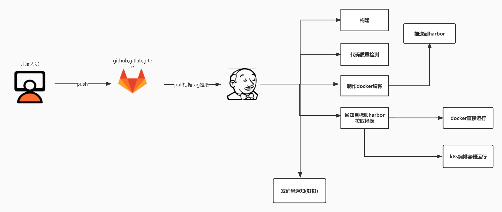

### devops-demo


* *说明*
```
  - 这是一个使用jenkins持续集成持续部署的例子
  - hello-jenkins是开发的样例代码
  - docker-gitlab是开发代码的仓库存储地址
  - docker-harbor是镜像存储地址
  - docker-jenkins持续集成持续部署的工具

  - 将docker-gitlab, docker-harbor, docker-jenkins分别部署到不同的主机上;并安装依赖
  - 将hello-jenkins下的代码推送到gitlab所在主机的仓库地址上;并给代码库创建一个tag
  - 登录jenkins的web管理页面,设置hello-jenkins/Jenkinsfile文件中对应变量的参数值(仔细核对)
  - 从gitlab中读取hello-jenkins/Jenkinsfile文件到jenkins系统中进行任务构建即可
```

* *架构图*
